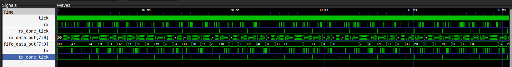
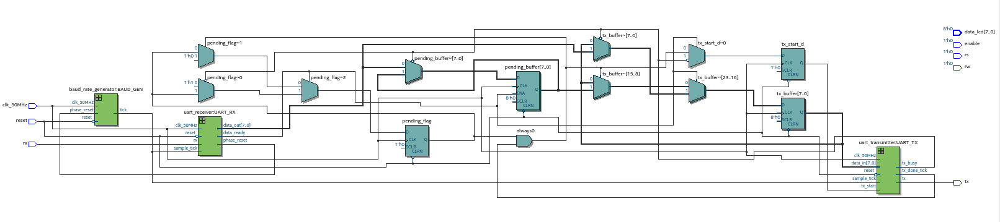
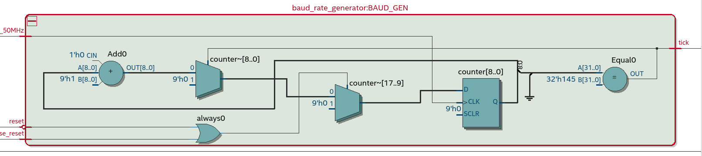
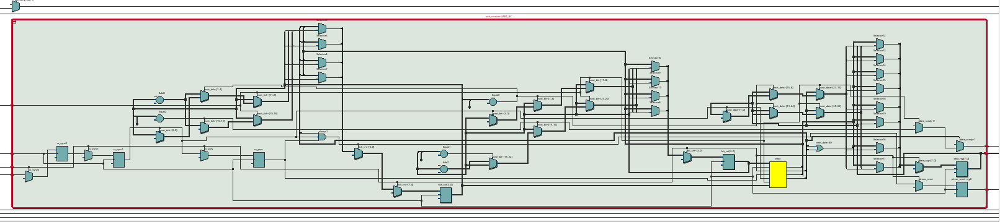
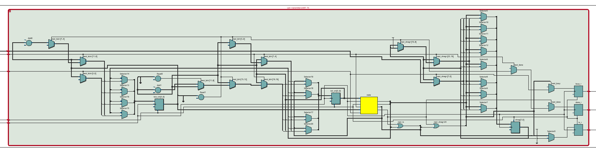

# SpaceLoRa

### Integrantes:
* Sergio Andrés Bolaños Penagos
* Johan Camilo Patiño Mogollón

## 1. Qué hace el proyecto

SpaceLoRa es un **sistema IoT de localización geográfica** completamente abierto y de bajo costo, implementado sobre una FPGA Cyclone IV. Captura sentencias GPS en formato NMEA 0183, las procesa en hardware para extraer latitud y longitud, y transmite estos datos vía radio de largo alcance usando LoRa (Para este caso SX1276 + ESP32). El prototipo incluye un nodo transmisor (FPGA + ESP32-LoRa) y un nodo receptor para monitoreo remoto en tiempo real, además de la FPGA como cabeza central donde toos los datos de posicion son obtenidos del modulo GPS NEO-6MV2 .

## 2. Justificación

- Las soluciones comerciales (por ejemplo Apple AirTag) y muchas plataformas LoRaWAN son **cerradas**, limitando la escalabilidad, personalización y estudio de protocolos internos.
- En entornos académicos y comunitarios se requieren plataformas **flexibles**, **modificables** y **documentadas**, que permitan a estudiantes e investigadores replicar y escalar fácilmente el sistema.
- SpaceLoRa responde a esta necesidad ofreciendo una arquitectura **modular**, **abierta** y validada mediante pruebas en condiciones reales.

## 3. Bloques que componen el proyecto

1. **GPS (NEO-6MV2)**  
   - Genera sentencias NMEA con datos de posición y tiempo que se transmiten vía UART.

2. **Baud Rate Generator** (`baud_rate_generator.v`)  
   - Divide el reloj principal (50 MHz) de la FPGA para obtener el pulso de habilitación a 9600 baudios.

3. **UART Receiver** (`uart_receiver.v`)  
   - Máquina de estados que sincroniza, detecta bits de inicio/parada y reconstruye bytes seriales que se mandan a la FIFO.

4. **FIFO Buffer** (`fifo.v`)  
   - Almacena temporalmente bytes recibidos, desacoplando la recepción UART del parsin, es la memoria RAM creada de la FPGA. Se encarga de almacenar los datos en caso de que sea necesario guardarlos mientras el módulo LoRa termina de enviar.

6. **UART Transmitter** (`uart_transmitter.v`)  
   - Toma los datos de la FIFO y los manda hacia el pin RX de la ESP32.

7. **ESP32 LoRa TX**  
   - Recibe datos de la FPGA y los transmite mediante LoRa (433 MHz) a un nodo remoto.

## 4. Pruebas
Para concer la precision y exactitud de nuestros dispositivos dispositivos en especial nuestro modulos TTGO ESP32 LoRA y GPS NEO-6MV2  se emplearon algunas pruebas de campo para conocer los datos que arroga nuestro modulo GPS y la distancia que se puede mantener una comunicacion estaable entre las TTGO ESP32 LoRa.
### 4.1 ESP32
- **Prueba cercana**: Se conectaron todos los componentes del sistema, realizando una prueba a menos de 5m para comprobar la potencia de la señal, la cual supera por más de 10-12 veces al ruido.
- **Prueba lejana**: Se realizó una prueba con dos módulos TTGO LoRa32 conectándose a más de 1km, dando resultados satisfactorios siempre que se encuentra en visión directa las dos antenas, es decir, sin obstáculos de por medio. Además, incluso en situaciones donde el ruido supera la señal se sigue recibiendo los datos.

### 4.2 GPS NEO-6MV2 

- **Prueba de datos**: Para el modulo GPS se hizo la misma prueba de testeo pero repetidamente, donde se buscaba conocer la precision del dispositivo pues debidoe al desarrollo del proyecto solo se usaban dos numeros de decimales, esto genera un gran desfase de posicion real vs posicion obtenida con el GPS. A pesar del error se considera que entra de un margen aceptable siendo casi de un desfase de 200-300 metros.

## 5. Replicar

Para replicar el comportamiento de este repositorio se debe
1. Contar con las herramientas necesarias para correr un proyecto de Verilog, como las extensiones requeridas, el software de visualización de señales como gtkwave y el software de Quartus para realizar todo lo relacionado a la FPGA Cyclone IV.
2. Realizar un proyecto en la FPGA Cyclone IV donde la entrada sea el módulo uart_top, también será necesario importar el resto de módulos internos usados.
3. Subir el código a la placa de desarrrollo Cyclone IV.

Para más información respecto al proyecto, abrir el archivo "informe_final_proyecto_digital.pdf" que se encuentra en la carpeta src/ del proyecto.

## 6. Simulaciones 

A continuación se muestra una simulación general de la aplicación, que fue generada con el testbench que se encuentra en este mismo repositorio.
En la simulación se reciben datos por el uart_rx, los cuales va almacenando hasta completar un byte a partir de estados en una máquina de estados que después se añaden a la fifo, y el transmisor toma los datos de la fifo cuando hay alguno dentro de ella y los manda de igual forma.

## 7. Módulos en Quartus

### Vista general:

### Baud rate generator

### UART receiver

### UART transmitter

## 7. Mejoras a futuro
Se sugieren las siguientes recomendaciones

1. Como forma principal se recomienda siempre hacer la verificación de cada modulo si es realmente lo que quieren que haga, pues durante el desarrollo del proyecto se realizaron cambios en los módulos debido a que se presentaban incompatibilidades o simplemente la tarea que se buscaba ya no la cumplía correctamente.
2. Mejorar y optimizar mejor los módulos para que no presenten fallos y tengan mas robustez al cambio de código, principalmente para los módulos que componen la FIFO y el NMEA-PARSER.
3. Con el avance o mejoras que se desee hacer con el proyecto, realizar sus respectivas pruebas tanto en simulaciones como en la implementación física para garantizar así un avance optimo.

